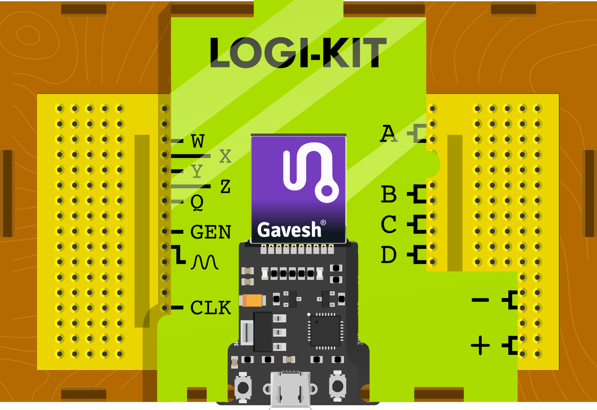

# Why Learn Digital Electronics?

Every device you use, from electronic watches to smartphones and self-driving cars, runs on chips built on the principles of digital electronics.

Making it the cornerstone of modern information society, shaping AI, robotics, and automation. By understanding it, you’re not just learning how these machines work; you’re stepping into the myriad possibilities you can achieve with this technology.

So, let’s explore this amazing technology and master it, starting with logic gates—the basic building blocks within microprocessors—using Gavesh™ LOGI-KIT!

# What is LOGI-KIT

LOGI-KIT is an ESP32-powered educational mini-computer designed to help students and electronics hobbyists understand the fundamentals of digital electronics and digital circuit design through hands-on experience.

It integrates all the essential electronics lab instruments into one device, including:

- Digital oscilloscope
- Analog/digital signal generator
- Digital power supply

This makes LOGI-KIT the all-in-one solution for learning and exploring digital electronics with hands-on experience.

# How to get start

Download the [Gavesh® App](https://play.google.com/store/apps/details?id=space.gaveshalabs.gavesha) from Play store and open the Digital Electronics course. Everything you need will be available there! 

Enjoy learning!

